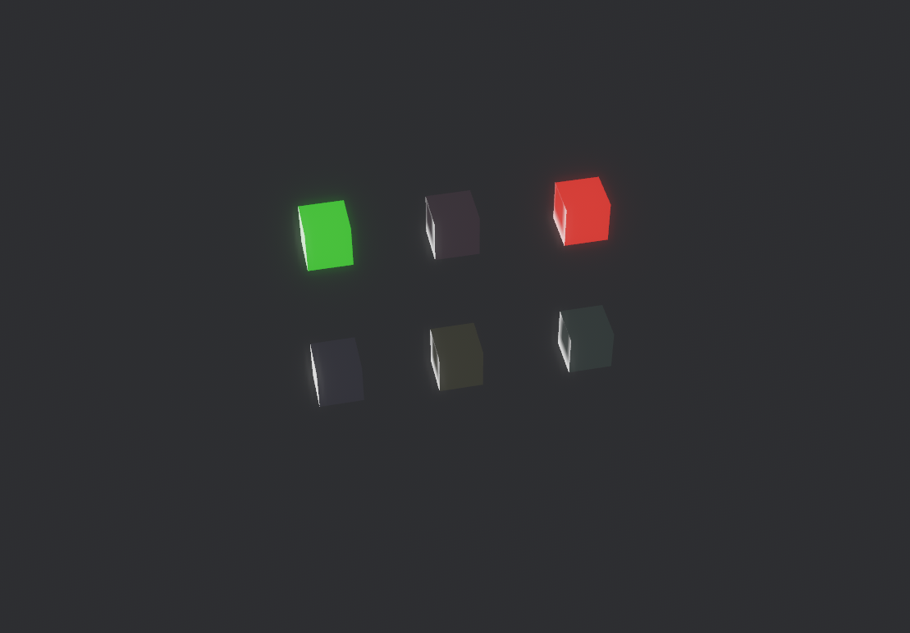
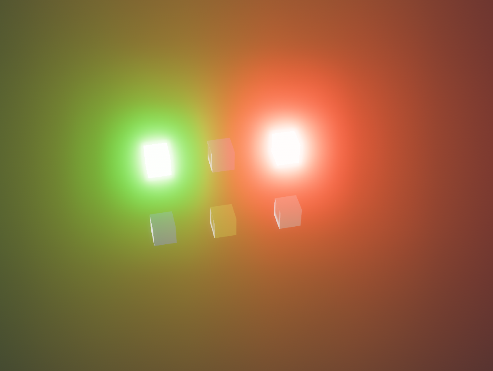

# Bevy GLTF Extended Loader (BGEL)

## What does this do?
This tool applies some (at the moment one) [Khronos glTF Extensions](https://github.com/KhronosGroup/glTF/blob/main/extensions/README.md) to the relevant materials.

Here is a list of the currently supported extensions. Feel free to ask for more or even open a pull request, if you have some implementation:
- [x] KHR_materials_emissive_strength

## Usage
Just add the `GLTFExtender` plugin.

## Examples
### Emissive Example
```
cargo run --example emissive_example
```
Shows an emissive example with massive bloom.


## Changes
### 0.1.0 Initial release
#### Features
- Simple support for KHR_materials_emissive_strength
  - Multiplies the emissive strength of the material by this value 
